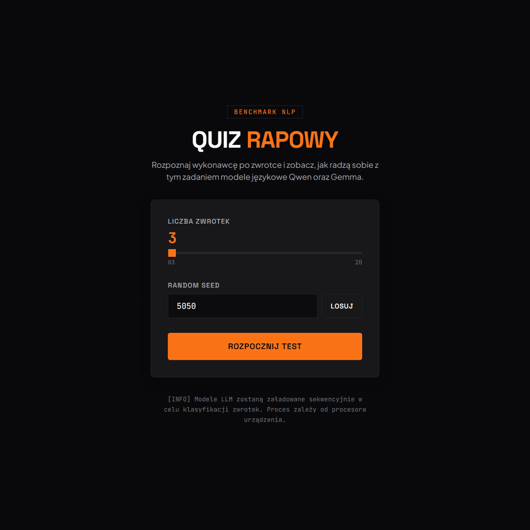

# Klasyfikator zwrotek polskiego rapu (PL)



## Opis projektu

Projekt dostraja dwa modele językowe - **Qwen3.5-4B** oraz **Gemma-4-E2B** - metodą **QLoRA** do rozpoznawania wykonawcy na podstawie tekstu zwrotki polskiego utworu rapowego. Zadanie sprowadza się do klasyfikacji sekwencji do **20 klas** (artystów). Zbiór danych został zbudowany samodzielnie z tekstów pobranych z serwisu Genius.

Częścią projektu jest interaktywna aplikacja **Quiz Rapowy** - pojedynek **Człowiek vs AI**, w którym gracz rozpoznaje wykonawcę zwrotki, a następnie porównuje swój wynik z predykcjami obu modeli. Całość demonstruje kompletny pipeline: przygotowanie danych, trening na GPU, inferencję oraz frontend.

## Główne funkcje

- Klasyfikacja zwrotek do **20 klas** (artystów) dwoma modelami LLM: Qwen3.5-4B i Gemma-4-E2B
- Fine-tuning metodą **QLoRA** (PEFT) z bibliotekami Unsloth i Transformers
- Samodzielnie zbudowany zbiór danych z **Genius API** (parsowanie utworów na zwrotki i czyszczenie)
- Baseline **TF-IDF + Multinomial Naive Bayes** jako punkt odniesienia
- Interaktywna aplikacja quizowa **Quiz Rapowy** (React + Vite) - pojedynek Człowiek vs AI
- Ewaluacja metrykami: **accuracy**, **macro-F1**, **top-3 accuracy**

## Elementy aplikacji

### 1. Przygotowanie danych (`dataset.ipynb`)

Pobieranie tekstów z Genius (biblioteka `lyricsgenius`), parsowanie utworów na pojedyncze zwrotki, czyszczenie i podział na zbiory. Wynik: `dataset/train.json` oraz `dataset/test.json` (6815 zwrotek treningowych + 1203 testowe, 20 etykiet).

### 2. Trening modeli (`trening-qwen.ipynb`, `trening-gemma.ipynb`)

Dostrajanie Qwen3.5-4B i Gemma-4-E2B metodą LoRA (`r=32`, `lora_alpha=64`) z trenowaną głowicą klasyfikacyjną i early stoppingiem wg macro-F1. Najlepsze wyniki na zbiorze testowym: **Qwen3.5-4B - 64,42% accuracy / 0,6311 macro-F1**, **Gemma-4-E2B - 57,19% / 0,5968**.

### 3. Inferencja (`inferencja-qwen.ipynb`, `inferencja-gemma.ipynb`, `classify.py`)

Wczytanie modelu bazowego i adapterów LoRA, a następnie klasyfikacja nowych zwrotek - predykcja artysty wraz z prawdopodobieństwem (softmax). Automatyczny wybór urządzenia: CUDA / MPS / CPU.

### 4. Aplikacja quizowa (`quiz-app/`)

Frontend React + Vite z czterema ekranami: konfiguracja (liczba zwrotek + seed), ekran ładowania ze streamingiem postępu klasyfikacji (SSE), pytania quizowe oraz podsumowanie porównujące wynik gracza z modelami Qwen i Gemma. Endpoint `/api/classify` uruchamia `classify.py` w tle.

### 5. Baseline (`Multinomial_Naive_Bayes.ipynb`)

Klasyczny model TF-IDF + Multinomial Naive Bayes jako prosty punkt odniesienia dla modeli LLM.

## Technologie i biblioteki

- **Python** 3.11+ (testowane na 3.13)
- **PyTorch**, Hugging Face **Transformers**, **PEFT**, **Unsloth**
- **scikit-learn** (baseline), **lyricsgenius** (Genius API)
- **Jupyter Notebook**
- **Node.js** 18+, **React**, **Vite** (aplikacja quizowa)
- Modele bazowe: `unsloth/Qwen3.5-4B`, `unsloth/gemma-4-E2B`

## Jak uruchomić

1. Utwórz środowisko Pythona i zainstaluj zależności:
   ```powershell
   python -m venv .venv
   .\.venv\Scripts\Activate.ps1
   pip install -r requirements.txt
   ```
2. Uruchom aplikację quizową (frontend):
   ```powershell
   cd quiz-app
   npm install
   npm run dev
   ```
3. Otwórz `http://localhost:5173`, ustaw liczbę zwrotek (3–20) i seed, a następnie kliknij **Rozpocznij test**.

**Uwagi:**
- Windows z GPU NVIDIA - najpierw zainstaluj PyTorch z CUDA, a dopiero potem `requirements.txt`. Do treningu w chmurze (Linux) służy `requirements-cloud.txt`.
- Przy pierwszym uruchomieniu pobierane są modele bazowe z Hugging Face (~20 GB miejsca, min. ~16 GB RAM).
- `dataset.ipynb` wymaga tokenu Genius: `$env:GENIUS_ACCESS_TOKEN = "twój_token"`.

<br>

# Polish Rap Verse Classifier (EN)

## Project Description

This project fine-tunes two language models - **Qwen3.5-4B** and **Gemma-4-E2B** - using **QLoRA** to recognize the performer based on the lyrics of a Polish rap verse. The task is a sequence classification into **20 classes** (artists). The dataset was built from scratch using lyrics fetched from Genius.

Part of the project is the interactive "Rap Quiz" application - a **Human vs AI** duel in which the player identifies the performer of a verse and then compares their score against the predictions of both models. The whole thing demonstrates a complete pipeline: data preparation, training on GPU, inference, and a frontend.

## Main Features

- Verse classification into **20 classes** (artists) with two LLMs: Qwen3.5-4B and Gemma-4-E2B
- Fine-tuning with **QLoRA** (PEFT) using the Unsloth and Transformers libraries
- A dataset built from scratch via the **Genius API** (splitting songs into verses and cleaning)
- A **TF-IDF + Multinomial Naive Bayes** baseline as a reference point
- The interactive quiz app (React + Vite) - a Human vs AI duel
- Evaluation metrics: **accuracy**, **macro-F1**, **top-3 accuracy**

## Application Components

### 1. Data Preparation (`dataset.ipynb`)

Fetching lyrics from Genius (the `lyricsgenius` library), splitting songs into individual verses, cleaning, and creating the splits. Output: `dataset/train.json` and `dataset/test.json` (6815 training verses + 1203 test verses, 20 labels).

### 2. Model Training (`trening-qwen.ipynb`, `trening-gemma.ipynb`)

Fine-tuning Qwen3.5-4B and Gemma-4-E2B with LoRA (`r=32`, `lora_alpha=64`), a trainable classification head, and early stopping based on macro-F1. Best results on the test set: **Qwen3.5-4B - 64.42% accuracy / 0.6311 macro-F1**, **Gemma-4-E2B - 57.19% / 0.5968**.

### 3. Inference (`inferencja-qwen.ipynb`, `inferencja-gemma.ipynb`, `classify.py`)

Loading the base model and the LoRA adapters, then classifying new verses - predicting the artist together with a probability (softmax). Automatic device selection: CUDA / MPS / CPU.

### 4. Quiz Application (`quiz-app/`)

A React + Vite frontend with four screens: configuration (number of verses + seed), a loading screen that streams classification progress (SSE), the quiz questions, and a summary comparing the player's score with the Qwen and Gemma models. The `/api/classify` endpoint runs `classify.py` in the background.

### 5. Baseline (`Multinomial_Naive_Bayes.ipynb`)

A classic TF-IDF + Multinomial Naive Bayes model as a simple reference point for the LLMs.

## Technologies and Libraries

- **Python** 3.11+ (tested on 3.13)
- **PyTorch**, Hugging Face **Transformers**, **PEFT**, **Unsloth**
- **scikit-learn** (baseline), **lyricsgenius** (Genius API)
- **Jupyter Notebook**
- **Node.js** 18+, **React**, **Vite** (quiz application)
- Base models: `unsloth/Qwen3.5-4B`, `unsloth/gemma-4-E2B`

## How to Run

1. Create a Python environment and install the dependencies:
   ```powershell
   python -m venv .venv
   .\.venv\Scripts\Activate.ps1
   pip install -r requirements.txt
   ```
2. Run the quiz application (frontend):
   ```powershell
   cd quiz-app
   npm install
   npm run dev
   ```
3. Open `http://localhost:5173`, set the number of verses (3–20) and the seed, then click **Rozpocznij test** ("Start test").

**Notes:**
- Windows with an NVIDIA GPU - install PyTorch with CUDA first, then `requirements.txt`. Cloud training (Linux) uses `requirements-cloud.txt`.
- On the first run, the base models are downloaded from Hugging Face (~20 GB of disk, min. ~16 GB RAM).
- `dataset.ipynb` requires a Genius token: `$env:GENIUS_ACCESS_TOKEN = "your_token"`.

<br>
